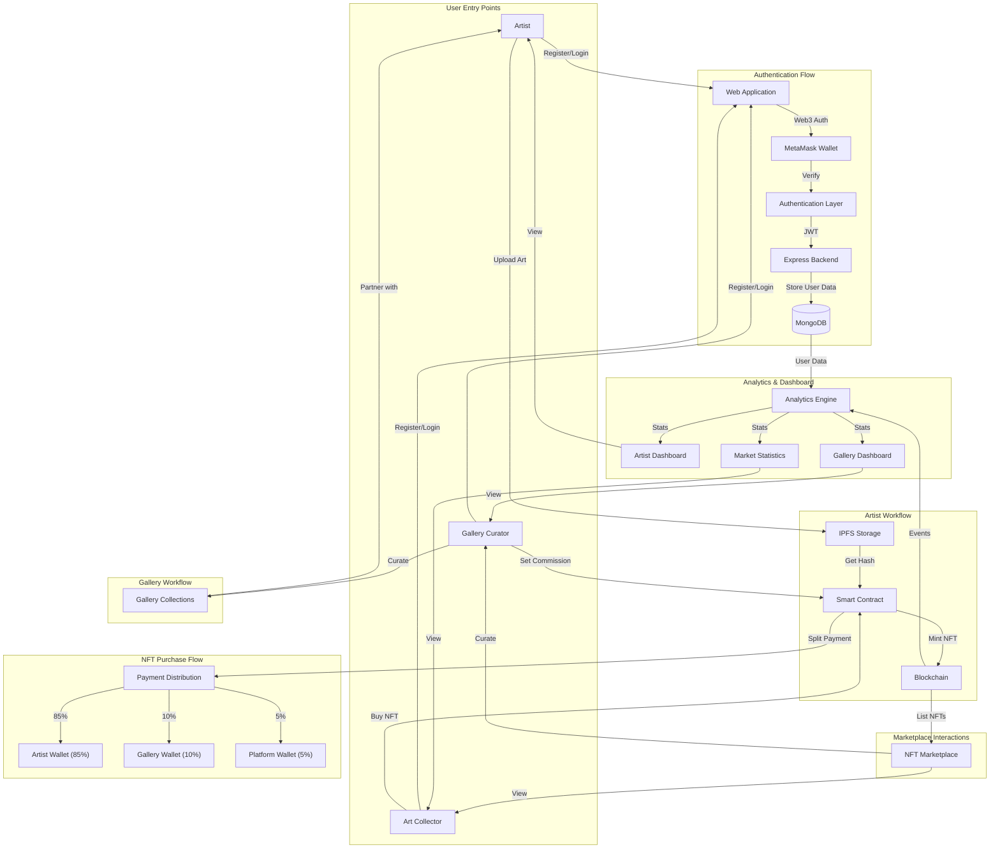

# ArtBlock - Decentralized Art Curation & Investment Platform

## Overview  
The **Digital Art Gallery Platform** bridges the gap between digital artists and curators by enabling the creation and management of professional virtual galleries. With an intuitive interface, curators can manage digital spaces while artists can showcase their work and discover opportunities to reach a broader audience.  

## Core Features  

### **Gallery Management**  
- Complete control over virtual spaces with customizable themes.  
- Set commission rates and establish submission guidelines.  
- Robust tracking of gallery statistics, visitor engagement, and artist contributions.  
- Support for multiple gallery configurations for diverse themes or communities.  

### **Artist Features**  
- Comprehensive portfolio submission and application tracking.  
- Real-time updates on application status and communication with curators.  
- Tools to manage portfolios, set artwork prices, and control visibility.  
- Integration with social media for enhanced exposure.  

### **Gallery Navigation**  
- **Overview Tab**: Essential statistics, featured artists, and recent activities.  
- **Artworks Tab**: Grid and list viewing options with search and filtering capabilities.  
- **Artists Tab**: Detailed artist profiles, portfolio previews, and performance metrics.  
- **Applications Tab**: Streamlined review process with organized queue and communication tools.  
- **Settings Tab**: Comprehensive control over gallery configurations and permissions.  

---

## System Architecture & Flows  

### **User Authentication Flow**  
- Secure sign-up/login process with role-based access control for curators and artists.  

### **Gallery Creation & Management Flow**  
- End-to-end flow for creating and customizing galleries, managing artworks, and tracking metrics.  

### **Artist Application Process**  
- Professional application system with status tracking, communication tools, and detailed submissions.  

### **Data Relationship Model**  
- Users, Galleries, Applications, Artists, and Artworks schemas interlinked for seamless management.  

### **Gallery View Navigation**  
- Tab-based interface optimized for efficient gallery exploration and management.  

---

## Technical Architecture  

### **Frontend Architecture**  
- **Framework**: React.js with component-based architecture for modularity.  
- **Styling**: Tailwind CSS for consistency, Framer Motion for smooth animations.  
- **Responsiveness**: Optimized for devices of all sizes.  

### **Database Architecture**  
- **Schemas**:  
  - **Users**: Manages authentication and roles.  
  - **Galleries**: Tracks gallery configurations and associations.  
  - **Applications**: Records artist submissions and review statuses.  
  - **Artists**: Manages profiles and portfolios.  
  - **Artworks**: Stores individual artwork details and gallery associations.  

---

## Security Features  
- **Role-based Access Control**: Ensures users have permissions aligned with their roles.  
- **Secure Authentication**: Strong protocols to protect user credentials.  
- **Data Validation**: Ensures integrity of submitted content and user data.  
- **Content Moderation Tools**: Maintains gallery integrity and user trust.  
- **Privacy Controls**: Safeguards user data and communication channels.  

---

## Future Enhancements  
- **NFT Integration**: Support for tokenized artworks.  
- **Virtual Gallery Tours**: Immersive VR-based gallery experiences.  
- **Advanced Analytics**: Enhanced insights into performance and engagement.  
- **Real-Time Notifications**: Instant updates on gallery activities.  
- **Integrated Chat System**: Seamless communication between users.  
- **Mobile App and PWA Support**: Broadened accessibility and convenience.  

---

## Project Status  
The project is currently in **active development**, with a focus on core feature implementation and optimization. It is designed for scalability, maintainability, and an exceptional user experience.  

---

## Contributing  
This project is **closed for external contributions**. For inquiries or potential collaboration, please contact the development team.  

---

## License  
All rights reserved. This project is **proprietary and confidential**.  

---

## Notes  
This documentation will evolve as the project progresses. Stay tuned for updates.  

